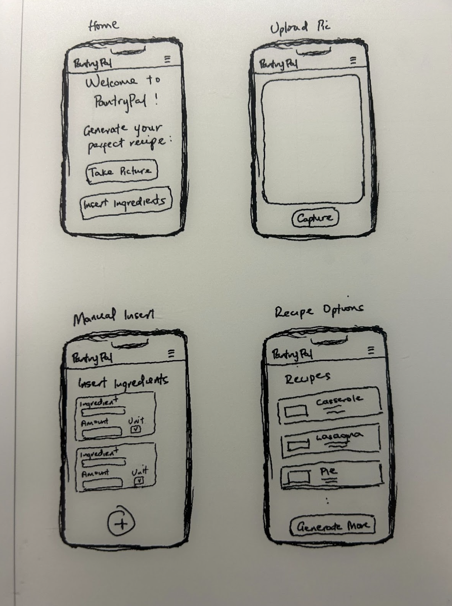

# Group 09 - PantryPal

## Project Description

Our application, designed for home cooks, food enthusiasts and people who just don’t know what to cook, aims to streamline the meal preparation process by generating recipes based on the ingredients users have on hand. By allowing users to take pictures of their fridge contents, the app will utilize AI to identify the ingredients and suggest a variety of recipes. The app will store data such as identified ingredients, user preferences, and recipe history to adapt to specific user needs better and create more tailored recipes. Our project could expand to include macros and nutritional information while it can get rid of some data storage and feedback requirements if necessary. This tool simplifies the cooking process making it easier and more enjoyable while reducing food waste.

## Team Members

- Sai Athoti
- Deep Parekh
- David Mwita
- Adi Poluri

  
## Project Task Requirements
- ### Minimal Requirements
  - Ingredient Input: Users must be able to manually input or upload pictures of their ingredients.
  - Recipe and Ingredient Storage: The system should store user-generated recipes along with their ingredients.
  - Recipe Retrieval: Provide basic functionality to return recipes based on the entered ingredients, even if initially mocked or simplified.
  - User Interface: Develop a basic user interface for inserting ingredients and viewing recipes, ensuring ease of use.
- ### Standard Requirements
  - Image-to-Text Conversion: Implement image-to-text conversion for recognizing food ingredients from uploaded pictures.
  - User Accounts: Develop user accounts to save recipes, user preferences, and a history of generated recipes.
  - Preference-Based Recipes: Take user preferences into account when generating recipes, tailoring outputs to individual tastes.
  - Advanced Recipe Generation: Employ machine learning models or external APIs to generate recipes based on user-inputted ingredients.
  - Recipe Interaction: Allow users to rate and favorite recipes, which will aid in refining and improving recipe suggestions.
- ### Stretch Requirements
  - Smart Ingredient and Recipe Memory: Save frequently used ingredients and recipes to streamline the generation process and prevent repetitive suggestions.
  - Nutritional Information: Integrate detailed nutritional information for each recipe, enhancing the app's health-oriented utility.
  - Voice Controls: Incorporate voice control functionalities, enabling users to interact with the app hands-free, which is particularly useful during cooking.

## Task Breakdown
- User should be able to manually insert or upload (a picture of) the ingredients
  - Develop a form where users can enter ingredient names and quantities manually.
  - Implement File Upload/Take Photo Component
  - Handle the processing and conversion of image data for use in the backend.
  - Provide the user with the ability to edit or confirm the extracted ingredients before final submission.
- Store user-generated recipes and ingredients
  - Define the data structure for storing recipes and their associated ingredients in a database.
  - Implement functionality to send user input (both manual and from image processing) to the backend server.
  - Develop a system to temporarily store data while the user adds more ingredients or completes other interactions during a session
  - Implement the final storage functionality that saves the completed recipes and their ingredients to the database
  - Provide users with confirmation once their data is successfully stored

## Sketch Prototypes

## References

